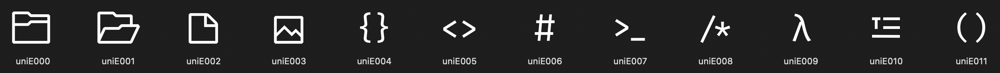
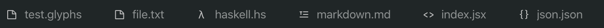

# Chalice icon theme for [Visual Studio Code](http://code.visualstudio.com)

[](https://github.com/artlaman/chalice-icon-theme/blob/master/LICENSE)
[](https://marketplace.visualstudio.com/items?itemName=artlaman.chalice-icon-theme)
[](https://marketplace.visualstudio.com/items?itemName=artlaman.chalice-icon-theme)

A minimalistic icon theme with the stupidest name I could come up with carefully chosen to fit the style of system VS Code icons. Recommended to use with [Chalice color theme](https://marketplace.visualstudio.com/items?itemName=artlaman.chalice-color-theme)

<p align="center">
  
</p>

## Whys

Most of the icon themes feature hundreds of icons for every existing framework, causing distraction and making the file explorer look like a sticker-bombed laptop (on the screen side).

<p align="center">
  
</p>
I believe that those logos should only be used for things they were created for: product representation and sticker-bombing, not for navigation. It’s just not functional. 🙃
It just so happened that most of the files have filename extensions which indicate file type, so instead of just duplicating them with shiny but useless logos, Chalice splits files into 10 easy-to-remember categories, tagging them with simple monochrome glyphs.

These categories are:

- Regular files that don’t fall into other categories
- Images
- JSON-like files
- XML-like files
- Styles
- Executables
- Lisps
- Code
- Haskell (special sort of category (theoretically))
- Markdown files

## Additionally

While others tend to use svg format, Chalice uses ttf font format, which brings font hinting and all that stuff into play, making icons look less blurry, which is especially noticeable on non-retina displays. Also, Visual Studio Code does not vertically align svg icons inside of the tabs properly.

<p align="center">
  
</p>
Using font format fixes this issue too
<p align="center">
  
</p>

To show twisties in File Explorer go to `Preferences → Extensions → Chalice Icons → Show Arrows` or add the following line to your `settings.json`

```json
{
  "chaliceIcons.showArrows": true
}
```

## What to do next

- If you found a file extension with wrong/missing category please [create an issue](https://github.com/artlaman/chalice-icon-theme/issues/new/choose) or submit pull request.
- If everything's fine, you can [buy me a coffee](https://www.buymeacoffee.com/artlaman)!
